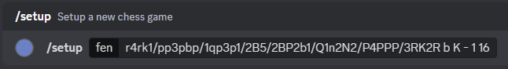
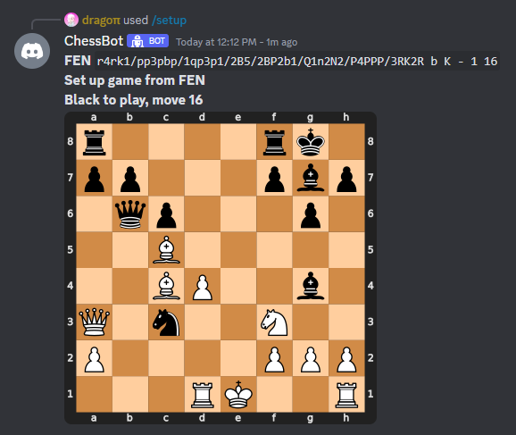
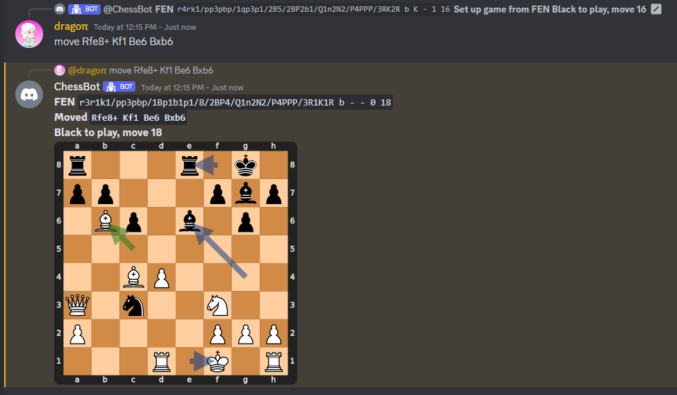

# Discord Chess Analysis Tool
Plan your chess game with friends collaboratively or analyze them in hindsight.

Simply evolve the position by replying to messages, resulting in a easily tracable tree-like history

Please keep in mind that it generally is considered cheating to get help from third parties during a game. Only use this if both sides previously agreed it to be allowed (i.e. a community vs community match) or if you use this for learning/solving puzzles outside of a match.

## Quickstart
1. Install python packages (see below)
2. Create a bot and add it to your server
3. Create file `.env`
```env
DISCORD_TOKEN=<your bot token>
```
4. run `bot.py`

### Set up a position from fen (or default)


### Add moves to the game by replying to a message


## Python Packages
- `python-dotenv`
- `cairosvg`
- `py-cord`
- `cairosvg`
- `python-chess`